# User guide

A step-by-step walkthrough of the s1-soc-investigation web UI: launch it, connect to your tenant,
choose and validate a catalog, set variables, run a single or batch investigation over a long lookback
or a fixed window, watch it complete, and pull back verified results. For the concepts behind it
(slicing, the cache, verification, error handling) see the [README](../README.md).

---

## 1. Launch

Run the published image, publishing to the host loopback and mounting a folder for output:

```bash
docker run --rm --pull=always -p 127.0.0.1:8901:8801 \
  -v "$PWD/investigations:/data" \
  ghcr.io/pmoses-s1/s1-soc-investigation:latest
```

Open **http://localhost:8901**. The header shows the active build version, so you can confirm which
image you are on. `--pull=always` ensures you are always on the newest published build. In Docker the
container makes the mounted `/data` folder writable automatically; if it still cannot write it prints a
clear fix and exits instead of crashing.

Every field in the UI has a **?** next to it. Hover it for a plain-language explanation.

---

## 2. Connect

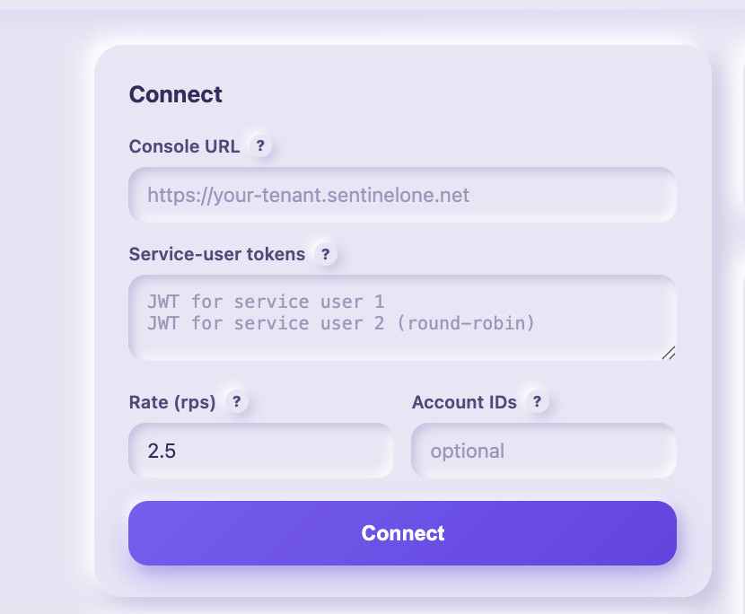

Enter your tenant's **Console URL** (the console host for the LRQ v2 API, for example
`https://your-tenant.sentinelone.net`, not the `xdr.*` V1 host) and one or more **service-user
tokens**, one per line to round-robin across identities (which roughly doubles the ~3 requests/sec
per-user rate budget).

- **Rate (rps):** per-token request rate. Keep at or below ~2.5 to stay under the 3 rps per-user cap.
- **Account IDs:** optional. Comma-separated account IDs scope the query (switches to `tenant=false`);
  blank queries tenant-wide.

Click **Connect**; tokens stay in the server process and are never sent back to the browser. Use **Test
connection** to confirm the token authenticates before a long run. Once connected, the panel collapses
to a one-line summary with an **Edit** button.

---

## 3. Choose and validate the catalog

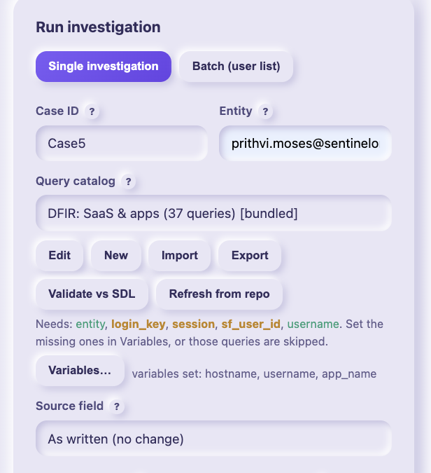

The top of the **Run investigation** panel is where the work begins: name the case, name the subject,
and point it at a catalog. Pick a **query catalog** (your standard query set; the dropdown shows its
live query count). The buttons below it manage it without leaving the UI:

- **Edit** the selected catalog, or **New** from a template. Each query has an `id`, `title`, `pq`
  (the PowerQuery), and a `merge` block telling the engine how to reassemble sliced results.
- **Import** a catalog file, or **Export** the selected one. Saved catalogs persist in your output folder.
- **Validate vs SDL** launches every query over a short recent window against your tenant and reports
  each as **valid**, **invalid** (a real syntax error), or **unknown** (transient). Run it before a
  90-day investigation so a bad query is caught in seconds, not mid-run.
- **Refresh from repo** pulls the latest catalogs from GitHub without rebuilding the image.

The line under the dropdown shows which variables the catalog needs (amber = still unset), so you know
what to fill in next.

---

## 4. Set investigation variables

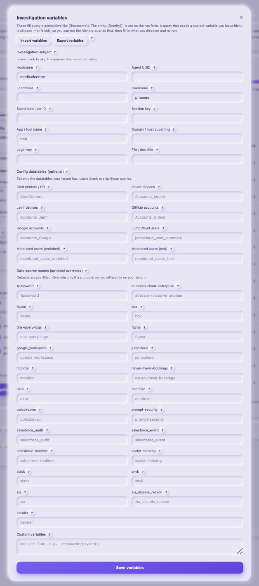

Click **Variables** to open the popup. Every environment- or subject-specific value in a query is a
variable here, grouped into three sections, each field with its own **?**:

- **Investigation subject:** `hostname`, `agent_uuid`, `ip`, `username`, `sf_user_id`, `session`,
  `app_name`, `domain`, `login_key`, `file_or_title`. A query whose subject variables are not all set
  is **skipped, not failed**, so you can run the identity phase first, then fill in what you discover
  and re-run to light up the rest.
- **Config datatables (optional):** the datatable names for the identity-mapping queries. Set the ones
  your tenant has; leave the rest blank to skip those queries.
- **Data source names (optional overrides):** the SDL `serverHost` sources each query reads (zia, okta,
  slack, salesforce, and so on). Each is pre-filled with a sensible default, so queries run out of the
  box; override one only if your tenant ingests that source under a different name.

**Import variables / Export variables** save the whole set to a JSON file or load one, so you can reuse
a configuration across cases or share it with a teammate. `{{entity}}` itself is set on the run form,
not here.

---

## 5. Configure and start the run

With a catalog chosen and variables set, the rest of the run form answers three questions: **who**,
**when**, and **how carefully**.

### Who: single or batch

Toggle **Single investigation** for one subject (set **Case ID** and **Entity**, which fills
`{{entity}}` in every query), or **Batch (user list)** to sweep many subjects at once.

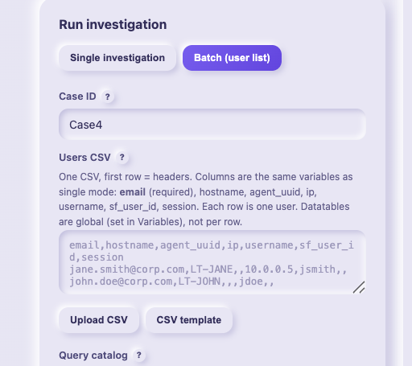

In batch mode, paste or **Upload CSV** a single file whose columns are the same variables as single
mode (`email` required, plus `hostname, agent_uuid, ip, username, sf_user_id, session, app_name,
domain, login_key, file_or_title`), one row per user. Datatables and source overrides stay global;
**CSV template** downloads a ready-made header row.

### When: the time window

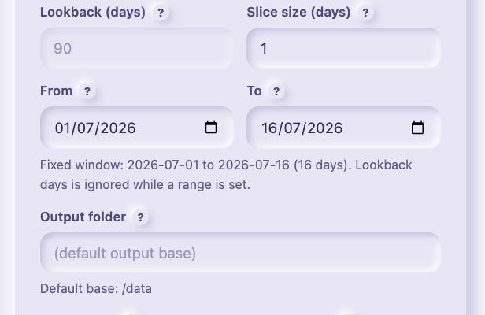

Use **Lookback (days)** for a rolling window, or set **From** and **To** for a fixed one (for example
all of April); set a range and Lookback greys out. **Output folder** is blank for the mounted `/data`.
**Worker pool** auto-sizes to tokens x 3 and shows the resulting aggregate rate; type a value to
override, or clear it to auto-size again.

### How carefully: execution options

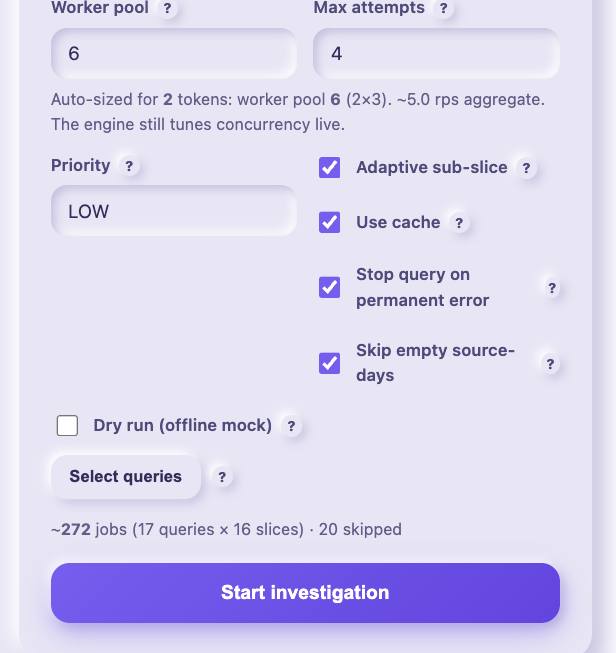

These control resilience and cost:

- **Adaptive sub-slice** splits a slow slice and retries the pieces; **Use cache** reuses immutable
  past-day results so only new or changed days re-run.
- **Stop query on permanent error** aborts a query that keeps failing, instead of re-failing it every
  day (the circuit breaker; see Tips).
- **Skip empty source-days** probes a source once per day and skips its queries when it has no data
  that day, which is a big saving on quiet sources.
- **Source field** (near the top of the form) forces every source anchor to `serverHost` or
  `dataSource.name`, or leaves each query as written, to match how your tenant records sources.

  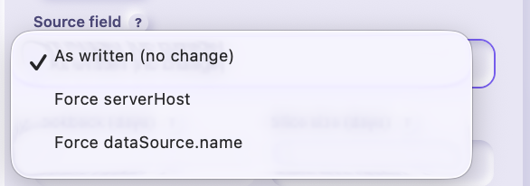

- **Dry run (offline mock)** exercises the whole flow with no tenant.

### Scope and preview

**Select queries** runs only a subset of the catalog. Search by id or title, use **Select all** to
toggle the filtered list (with a live count), and the cost preview shows the job count (runnable
queries x slices, with a skipped count) before you commit.

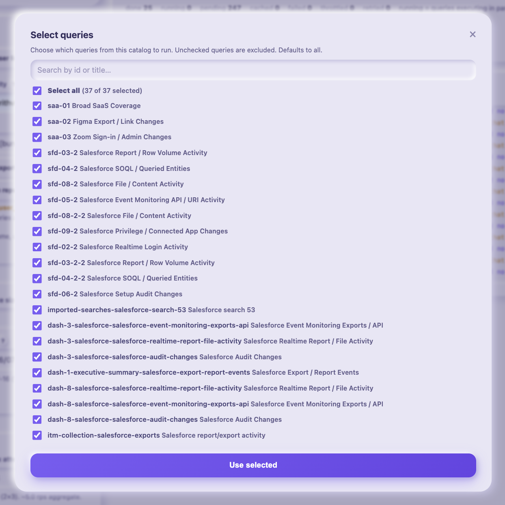

Click **Start investigation** (or **Start batch investigation**).

---

## 6. Watch it run

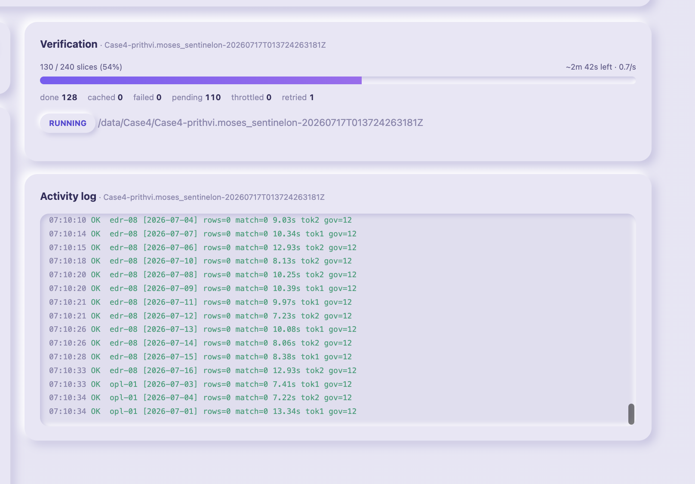

A progress bar tracks completed slices against the plan with a live throughput and estimated time
remaining. The tiles below it show **done**, **running** (queries executing in parallel right now),
**pending**, **cached**, **failed**, **throttled**, and **retried** counts as they change. The
**Activity log** streams every event: the plan, each slice completing (row count, elapsed time, which
token ran it, and the current concurrency limit `gov=`), cache hits, retries, sub-slicing, throttles,
and any aborts. When a source has no data for a day, a highlighted **NO DATA** line is logged once and
that source's queries for the day are skipped. The full trace is also written to `activity.jsonl` in
the run folder. You can **Cancel** a run at any time; it stops after in-flight slices finish and stays
resumable.

---

## 7. Verify, preview, and download

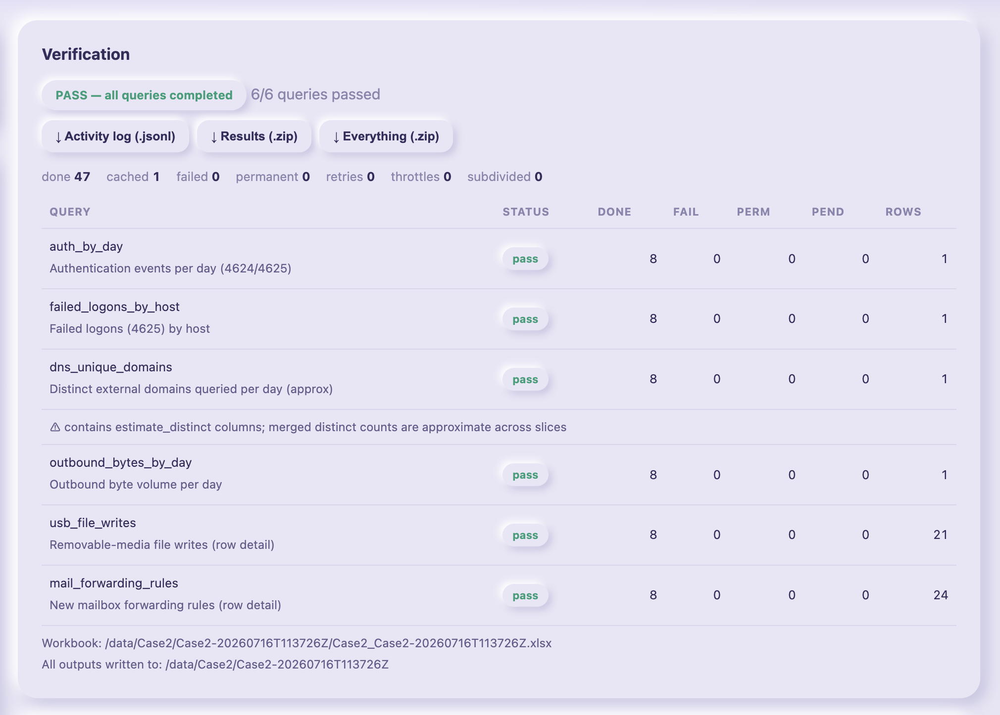

When the run finishes, the **Verification** panel gives the verdict: it passes only when every slice of
every query completed. Queries are sorted **findings-first**, with a badge for how many have hits and
the total row count. The per-query table shows status (**pass / failed / incomplete / skipped**) with
done / failed / skip counts and the merged row count, and shows the exact backend error for any query
that failed. The stats line includes done, cached, failed, permanent, aborted, retries, throttles, and
subdivided totals.

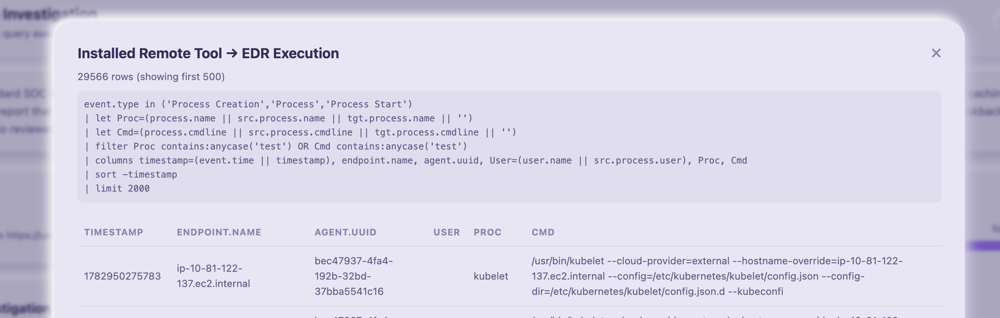

**Click any query** to preview its merged results inline, with the exact PowerQuery that produced them
at the top. Download buttons give you the **Activity log (.jsonl)**, **Results (.zip)** (merged results,
workbook, manifest, logs), and **Everything (.zip)** (the above plus raw per-slice output). If a run is
incomplete or cancelled, a **Resume** button re-runs its outstanding slices. Each run also writes a
per-case `.xlsx` workbook (a Summary sheet plus one tab per query showing its PowerQuery). All outputs
land under `<output>/<case>/<run_id>/`; see the [output layout](../README.md#output-layout).

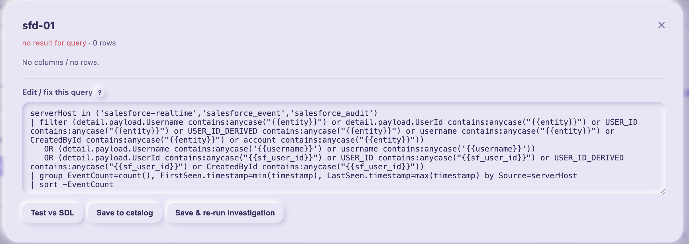

**Fix a failed query in place.** Opening a failed query shows its editable template under **Edit / fix
this query**. Adjust it, **Test vs SDL** over a short window to confirm SDL accepts it, **Save to
catalog**, and **Save & re-run investigation** to start a fresh run for the same case using the fix.
Because past days are cached, only the fixed query actually re-executes.

---

## 8. Recent runs

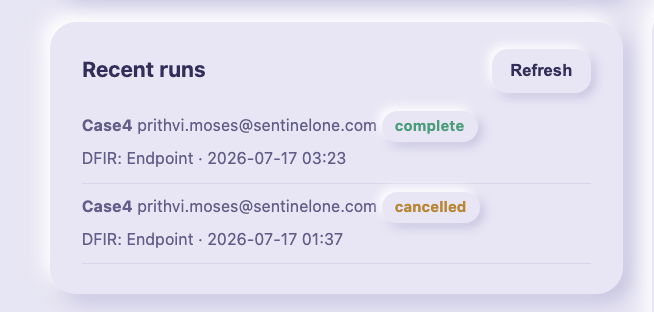

The **Recent runs** card lists past investigations (case, entity, catalog, date, and status) and
survives restarts. Click any row to reopen it: its progress, verification, and downloads load straight
back up, and an incomplete or cancelled run can be resumed from there.

---

## Tips

- **Broken queries fix themselves out of the way.** If a query is rejected (400 syntax) or keeps
  failing after retries and subdivision (a 500 from a bad query), the **circuit breaker** aborts that
  query's remaining slices and flags it as needing a fix, while the other queries keep running. See the
  reason in the verification table, fix the query (Edit, then Validate vs SDL), and start a **new run
  for the same case**: cached past days mean only the fixed query re-executes. (Plain Resume keeps the
  original query text; use a new run to pick up an edited query.) The full model is in the
  [README error-handling section](../README.md#error-handling-and-recovery).
- **Offline demo:** tick **Dry run** to exercise the whole flow against a built-in fake backend with no
  tenant or credentials.
- **Serving to other hosts:** the UI is loopback-only by default. To expose it, set `S1IE_BIND_ALL=1`
  and a strong `S1IE_AUTH_TOKEN`, then open `http://<host>:8901/?token=<secret>`. See the
  [README security section](../README.md#security-and-hardening).
